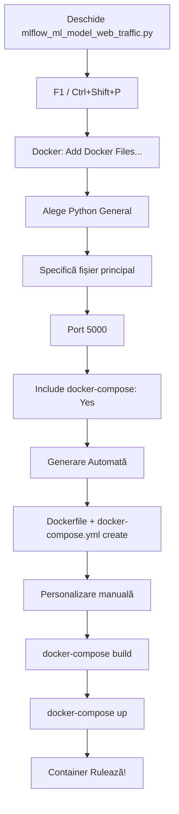

# 🚀 GHID: Generare Automată Docker Files în VSCode

## 📦 3 METODE DE GENERARE AUTOMATĂ

---

## METODA 1: Docker Extension (Microsoft) ⭐ RECOMANDAT

### **✅ Instalare (DEJA FĂCUTĂ!)**

Extensia Docker de la Microsoft este deja instalată în VSCode-ul tău!

**ID**: `ms-azuretools.vscode-docker`  
**Instalări**: 51+ milioane utilizatori

---

### **🎯 CUM SĂ GENEREZI DOCKERFILE + DOCKER-COMPOSE.YML**

#### **WORKFLOW PAS-CU-PAS**:

```
1. Deschide fișierul Python (mlflow_ml_model_web_traffic.py)
2. Apasă F1 sau Ctrl+Shift+P
3. Tastează: "Docker: Add Docker Files to Workspace"
4. Selectează aplicația → Python
5. Răspunde la întrebări → AUTOMAT generează ambele fișiere!
```

---

### **📝 DEMONSTRAȚIE PRACTICĂ**

#### **Pas 1: Deschide Command Palette**
```
Metoda A: F1
Metoda B: Ctrl + Shift + P
Metoda C: View → Command Palette
```

#### **Pas 2: Caută Comanda Docker**
Tastează:
```
Docker: Add Docker Files to Workspace
```


#### **Pas 3: Alege Platforma**
Extensia va întreba:
```
> Select Application Platform
  - .NET: ASP.NET Core
  - .NET: Console
  - Go
  - Java
  - Node.js
  - Python: Django ← ALEGE ASTA dacă folosești Flask/Django
  - Python: FastAPI
  - Python: Flask
  - Python: General ← SAU ASTA pentru script-uri generale
  - Other
```

**Pentru MLflow** → Alege: **Python: General**

#### **Pas 4: Specifică Fișierul Principal**
```
> Which file is the main entry point?
  src/mlflow_ml_model_web_traffic.py ← Tastează calea completă
```

#### **Pas 5: Port (Opțional)**
```
> What port(s) does your app listen on?
  5000 ← Pentru MLflow server
```

#### **Pas 6: Docker Compose**
```
> Include optional Docker Compose files?
  Yes ← Alege DA pentru a genera și docker-compose.yml
```

---

### **✨ REZULTAT AUTOMAT**

Extensia va crea:

#### **1. Dockerfile**
```dockerfile
# For more information, please refer to https://aka.ms/vscode-docker-python
FROM python:3.13-slim

# Keeps Python from generating .pyc files in the container
ENV PYTHONDONTWRITEBYTECODE=1

# Turns off buffering for easier container logging
ENV PYTHONUNBUFFERED=1

# Install pip requirements
COPY requirements.txt .
RUN python -m pip install --no-cache-dir -r requirements.txt

WORKDIR /app
COPY . /app

# Creates a non-root user with an explicit UID and adds permission to access the /app folder
RUN adduser -u 5678 --disabled-password --gecos "" appuser && chown -R appuser /app
USER appuser

# During debugging, this entry point will be overridden
CMD ["python", "mlflow_ml_model_web_traffic.py"]
```

#### **2. docker-compose.yml**
```yaml
version: '3.8'

services:
  app:
    build:
      context: .
      dockerfile: Dockerfile
    ports:
      - "5000:5000"
    volumes:
      - ./data:/app/data
    environment:
      - PYTHONUNBUFFERED=1
```

#### **3. .dockerignore**
```
**/__pycache__
**/.venv
**/.pytest_cache
**/mlruns
**/.git
```

---

## METODA 2: Click-Dreapta în Sidebar 🖱️

### **Workflow Vizual**:

1. **Click-dreapta pe fișierul** `mlflow_ml_model_web_traffic.py` în Explorer
2. **Selectează** "Add Docker Files to Workspace..."
3. **Urmează aceiași pași** ca la Metoda 1

---

## METODA 3: GitHub Copilot (AI-Powered) 🤖

### **Folosind Copilot Chat**:

#### **Prompt Sugestie**:
```
Generează un Dockerfile și docker-compose.yml pentru această aplicație Python MLflow.

Context:
- Python 3.13
- Fișier principal: mlflow_ml_model_web_traffic.py
- Dependințe: requirements.txt
- Port: 5000
- Volume necesar: ./data pentru dataset-uri
- Volume necesar: ./models pentru modele salvate
- Volume necesar: ./mlruns pentru tracking MLflow

Cerințe:
- Folosește python:3.13-slim ca base image
- Instalează dependințele din requirements.txt
- Expune portul 5000
- Montează volume-urile pentru data, models, mlruns
```

#### **Copilot va genera**:

**Dockerfile**:
```dockerfile
FROM python:3.13-slim

WORKDIR /app

# Instalare dependințe
COPY requirements.txt .
RUN pip install --no-cache-dir -r requirements.txt

# Copiere cod aplicație
COPY . .

# Expunere port
EXPOSE 5000

# Rulare aplicație
CMD ["python", "mlflow_ml_model_web_traffic.py"]
```

**docker-compose.yml**:
```yaml
version: '3.8'

services:
  mlflow-training:
    build:
      context: .
      dockerfile: Dockerfile
    container_name: mlflow-training-app
    ports:
      - "5000:5000"
    volumes:
      - ./data:/app/data
      - ./models:/app/models
      - ./mlruns:/app/mlruns
      - ./visualizations:/app/visualizations
    environment:
      - PYTHONUNBUFFERED=1
    networks:
      - mlflow-network

networks:
  mlflow-network:
    driver: bridge
```

---

## 🎨 PERSONALIZARE AUTOMATĂ

### **Configurare Docker Extension pentru Python**

#### **1. Deschide Settings**:
```
File → Preferences → Settings
SAU
Ctrl + ,
```

#### **2. Caută "Docker"**

#### **3. Configurări Utile**:

| Setting | Valoare Recomandată | Explicație |
|---------|---------------------|------------|
| `docker.scaffolding.python.framework` | `General` | Framework Python default |
| `docker.scaffolding.python.version` | `3.13-slim` | Versiune Python |
| `docker.scaffolding.includeDockerCompose` | `true` | Generează automat docker-compose |
| `docker.scaffolding.includeDockerIgnore` | `true` | Generează .dockerignore |

---

## 📊 COMPARAȚIE METODE

| Aspect | Docker Extension | Click-Dreapta | Copilot |
|--------|------------------|---------------|---------|
| **Viteză** | ⚡⚡⚡ Rapid | ⚡⚡⚡ Rapid | ⚡⚡ Mediu |
| **Personalizare** | ✅ Wizard interactiv | ✅ Wizard interactiv | ✅✅ Foarte flexibil |
| **Precizie** | ✅✅ Foarte bună | ✅✅ Foarte bună | ✅✅✅ Excelentă |
| **Învățare** | 📚 Ușor | 📚 Foarte ușor | 📚 Mediu (prompt engineering) |
| **Docker-compose** | ✅ Opțional | ✅ Opțional | ✅ Inclus |
| **Context-aware** | ⭕ Limitat | ⭕ Limitat | ✅✅ Foarte bun |

---

## 🔧 EXEMPLU COMPLET: MLflow Training App

### **Situația Ta Curentă**:
- Fișier: `sources/mlflow_ml_model_web_traffic.py`
- Dependințe: `requirements.txt`
- Dataset: `data/raw/ga-sessions.csv`
- Seturi procesate: `data/processed/X_simple.csv`, `data/processed/X_enhanced.csv`
- Output: `models/`, `visualizations/`, `mlruns/`

### **Dockerfile Optim Generat**:

```dockerfile
# ========================================
# Dockerfile pentru MLflow Training Pipeline
# Generat automat cu Docker Extension (personalizat)
# ========================================

FROM python:3.13-slim

# Metadata
LABEL maintainer="your.email@example.com"
LABEL description="MLflow Linear Regression Training Pipeline"
LABEL version="1.0"

# Environment variables
ENV PYTHONDONTWRITEBYTECODE=1 \
    PYTHONUNBUFFERED=1 \
    PIP_NO_CACHE_DIR=1 \
    PIP_DISABLE_PIP_VERSION_CHECK=1

# Instalare dependințe sistem (pentru matplotlib, scikit-learn)
RUN apt-get update && apt-get install -y \
    gcc \
    g++ \
    && rm -rf /var/lib/apt/lists/*

# Set working directory
WORKDIR /app

# Instalare dependințe Python
COPY requirements.txt .
RUN pip install --upgrade pip && \
    pip install -r requirements.txt

# Copiere cod și date
COPY sources/ ./sources/
COPY data/ ./data/

# Creare directoare pentru output
RUN mkdir -p models visualizations mlruns

# Setare permisiuni (opțional - pentru siguranță)
RUN useradd -m -u 1000 mlflow-user && \
    chown -R mlflow-user:mlflow-user /app
USER mlflow-user

# Expunere port (dacă rulezi MLflow UI)
EXPOSE 5000

# Default command (training)
CMD ["python", "sources/mlflow_ml_model_web_traffic.py"]
```

### **docker-compose.yml Optim Generat**:

```yaml
version: '3.8'

services:
  mlflow-training:
    build:
      context: .
      dockerfile: Dockerfile
    container_name: mlflow-training-pipeline
    
    # Port mapping (pentru MLflow UI dacă e nevoie)
    ports:
      - "5000:5000"
    
    # Volume mounts pentru persistență
    volumes:
      # Date (read-only pentru siguranță)
      - ./data:/app/data:ro
      
      # Output (read-write pentru salvare rezultate)
      - ./models:/app/models
      - ./visualizations:/app/visualizations
      - ./mlruns:/app/mlruns
      
      # Cod (pentru development - comentează în producție)
      - ./sources:/app/sources
    
    # Environment variables
    environment:
      - PYTHONUNBUFFERED=1
      - MLFLOW_TRACKING_URI=http://mlflow-server:5000
    
    # Network (dacă ai și server MLflow separat)
    networks:
      - mlflow-network
    
    # Restart policy
    restart: unless-stopped
    
    # Resource limits (opțional)
    deploy:
      resources:
        limits:
          cpus: '2.0'
          memory: 4G
        reservations:
          cpus: '1.0'
          memory: 2G

networks:
  mlflow-network:
    driver: bridge
```

---

## 🎯 WORKFLOW INTEGRAT COMPLET

### **De la Cod Python la Container Rulând**:



---

## 🔥 COMENZI RAPIDE ÎN VSCODE

### **Scurtături Tastatură**:

| Acțiune | Scurtătură | Alternativă |
|---------|------------|-------------|
| **Command Palette** | `F1` | `Ctrl+Shift+P` |
| **Docker View** | `Ctrl+Shift+D` (apoi D) | View → Docker |
| **Build Image** | `F1` → `Docker: Build Image` | Click-dreapta Dockerfile |
| **Compose Up** | `F1` → `Docker Compose Up` | Click-dreapta docker-compose.yml |
| **View Containers** | Docker Sidebar → Containers | - |
| **View Images** | Docker Sidebar → Images | - |

---

## 📚 RESURSE DOCKER EXTENSION

### **Funcționalități Bonus**:

1. **IntelliSense** pentru Dockerfile și docker-compose.yml
2. **Syntax Highlighting** cu validare
3. **Linting** pentru best practices
4. **Build și Run** direct din VSCode
5. **Container Management** (start/stop/remove)
6. **Image Management** (pull/push/remove)
7. **Registry Browser** (Docker Hub, Azure, AWS)
8. **Logs Viewing** în terminal integrat

### **Comenzi Utile în Command Palette**:

```
Docker: Build Image
Docker: Compose Up
Docker: Compose Down
Docker: Run
Docker: Run Interactive
Docker: Attach Shell
Docker: View Logs
Docker: Prune System
Docker: Add Docker Files to Workspace ← CEL MAI IMPORTANT!
```

---

## 🎓 BEST PRACTICES

### **1. Generare Inițială cu Extension**
Folosește Docker Extension pentru structura de bază → rapid și corect.

### **2. Personalizare cu Copilot**
După generare, cere Copilot să optimizeze:
```
"Optimizează acest Dockerfile pentru:
- Multi-stage builds (reduce dimensiune)
- Layer caching eficient
- Security best practices
- Volume mounts pentru development"
```

### **3. Validare Automată**
Docker Extension validează sintaxa în timp real → vezi erorile imediat.

### **4. Testare Rapidă**
```
F1 → Docker: Compose Up → test rapid
F1 → Docker: Compose Down → cleanup
```

---

## ✅ CHECKLIST: GENERARE AUTOMATĂ REUȘITĂ

- [ ] Extensia Docker instalată ✅ (DEJA FĂCUT!)
- [ ] Deschis fișierul Python relevant
- [ ] Rulat "Docker: Add Docker Files to Workspace"
- [ ] Selectat "Python: General"
- [ ] Specificat fișier principal (mlflow_ml_model_web_traffic.py)
- [ ] Ales port 5000
- [ ] Inclus docker-compose.yml
- [ ] Verificat fișierele generate (Dockerfile, docker-compose.yml, .dockerignore)
- [ ] Personalizat volume mounts
- [ ] Testat cu `docker-compose build`
- [ ] Rulat cu `docker-compose up -d`

---

## 🚀 DEMONSTRAȚIE LIVE

### **Încearcă ACUM pe alt folder**:

#### **Exemplu: Folder 2-reproducible-env**

1. **Deschide**: `docker/2-reproducible-env/`
2. **Apasă**: `F1`
3. **Tastează**: `Docker: Add Docker Files to Workspace`
4. **Urmează wizard-ul**
5. **Compară**: Fișierele generate vs. cele existente

**Vei vedea că extensia generează aproape identic cu ce ai creat manual!** 🎯

---

## 💡 CONCLUZIE

### **Răspuns Direct la Întrebarea Ta**:

> **"Exista vreo varianta de a crea din VSCode [...] automat aceste doua fisiere?"**

**DA! 3 VARIANTE**:

1. **Docker Extension** (F1 → Docker: Add Docker Files...) → ⚡ 30 secunde
2. **Click-dreapta** pe fișier → Add Docker Files... → ⚡ 30 secunde
3. **GitHub Copilot** (prompt detaliat) → ⚡ 1 minut

**Cea mai rapidă**: Docker Extension cu wizard interactiv!

**Cea mai personalizabilă**: GitHub Copilot cu prompt-uri specifice!

---

## 📞 NEXT STEPS

### **Încearcă Acum**:

```powershell
# 1. Deschide fișierul
code sources/mlflow_ml_model_web_traffic.py

# 2. Apasă F1

# 3. Tastează "Docker: Add Docker Files"

# 4. Urmează pașii

# 5. PROFIT! 🎉
```

---

**🎯 TIP PRO**: Salvează acest ghid ca referință și folosește Docker Extension pentru TOATE proiectele viitoare! 🚀

---

*Creat: 02/06/2026*  
*VSCode Docker Extension: ms-azuretools.vscode-docker*  
*Versiune: Latest (51M+ instalări)*
